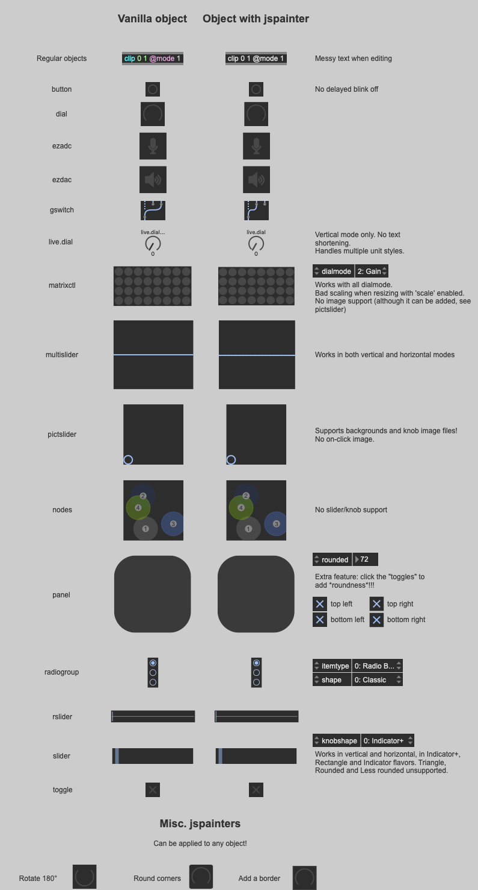

# JSPAINTER/JSUI remakes of builtin Cycling'74 Max objects

The goal of this repository is to collect simple jsui/jspainter remakes of builtin Max objects.

Currently it only contains jspainter files, but it is open to contributions for jsui.

The original commit of this repo include code borrowed from official [Max documentation](https://docs.cycling74.com/max8, the [C74 forum](https://cycling74.com/forums?page=1) and the Max Discord. Original authors, when known, are credited, and a mention is made if the code has been modified.

For supercharged alternatives to builtin objects (dial, filtergraph, function, preset...) with additionnal features and slick looks, check the [JSUI showcase](https://github.com/jamesb93/JSUI-Showcase) repo.

## Why this repo?
Quite frequently we want to use native Max UI objects, but with small visual changes that aren't possible only with the objects attributes. Recreating the original look of the object from scratch might feel tedious. But now with this repo you can start your jspainter or jsui file from code which already does that. You just need to add your own modifications to it.

## How to use
If you're here you probably know how to deal with jspainter and jsui files in Max. Otherwise, start by having a look at the official documentation for [jspainter](https://docs.cycling74.com/max8/vignettes/jspainter), [jsui](https://docs.cycling74.com/max8/vignettes/jsuiobject) and [mgraphics](https://docs.cycling74.com/max8/vignettes/jsmgraphics). The builtin jspaintertest.maxpat is another good place to start (some code here comes from that example).

## Contributing

There are various ways to contribute to this repo:
- Add more jspainter examples
- Add their jsui counterpart (after all a jsui file is mostly like the jspainter one, with additionnal code to handle user interactions and attributes)
- Improve the existing code:
  - Make the result look more like the original UI
  - Make it handle more cosmetic attributes (slider's `knobshape`, multislider's `setstyle`, live.dial's `appearance`, etc.)
  - Make it more readable or more efficient

### jspainter contribution guideline
- jspainter files should either be for one specific object (and named `<object_name>_jspainter.js`), or for multiple, if not any object (and named `misc_<what_it_does>_jspainter.js`)
- They should draw the object as closely as the original object as possible
- Noticeable differences from original objects or unhandled attributes should be notified in the code's comments
- They should not rely on `mgraphics.parentpaint()`, unless they're misc jspainter files made to be used with various objects
- They should rely on the existing objects attributes as much as possible
- They should be as readable as possible, with meaningful variable names and comments higlighting its various parts

### jsui contribution guidelines
- jsui files should be meant to mimick specifically one builtin Max object, and be names `<object_name>_jsui.js`
- They should draw the object and react to messages and user inputs as closely as the original object as possible
- Variable names should match the original objects attribute names
- The code may not contain any extra feature that the mimicked object do not have. "Small" additions (like rounded corners, resizing, etc. are welcome though).
- Noticeable differences from original objects should be notified in the code's comments
- They should be as readable as possible, with meaningful variable names and comments higlighting its various parts

### How to contribute
1. Clone this repository
2. Make modifications on your local branches
3. Commit and push your modifications on your local branch
4. [Make a pull request](https://guides.github.com/activities/forking/#making-a-pull-request) to this repo

or contact me (see my [github profile](https://github.com/Teufeuleu))
